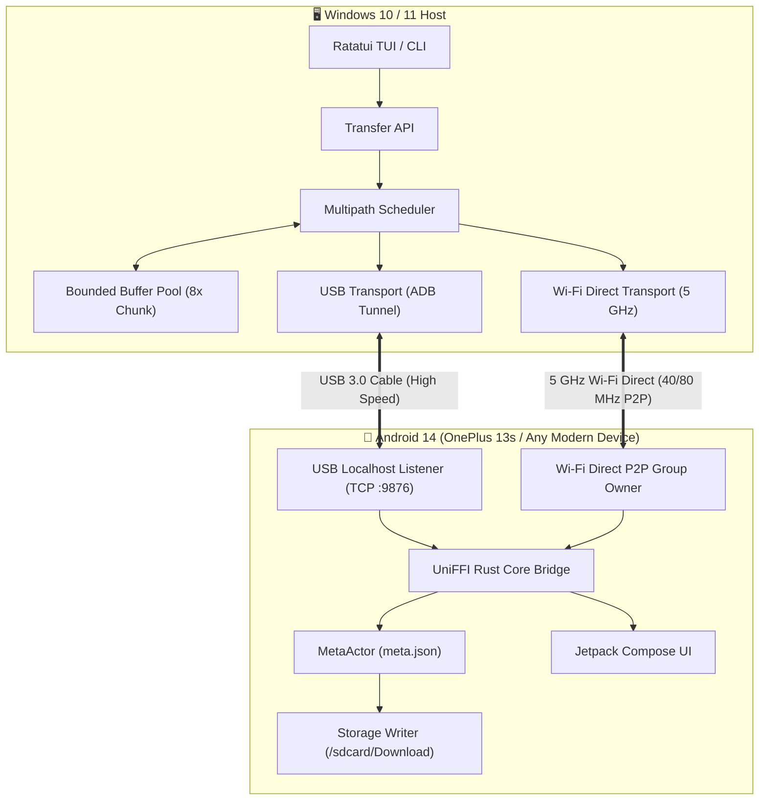

# 🚀 TurboTransfer

<div align="center">

**Ultra-High-Speed Multipath File Transfer Engine between Android & Windows**  
*Simultaneous USB 3.0 (ADB Tunnel) + 5 GHz Wi-Fi Direct P2P Transmission*

[](https://www.rust-lang.org/)
[](https://developer.android.com/)
[](https://www.microsoft.com/windows)
[](https://ratatui.rs/)
[](LICENSE)
[](https://github.com/)

</div>

---

## 📖 Overview

**TurboTransfer** is a high-throughput, cross-platform file transfer system engineered specifically for massive file transfers (4K/8K video, RAW photo libraries, disk images, game backups) between Windows PCs and Android devices.

Unlike traditional transfer tools (MTP, Bluetooth, or single-channel HTTP/SMB servers), TurboTransfer **bonds physical USB 3.0 and high-speed 5 GHz Wi-Fi Direct links into a unified multipath stream**. It combines a stateful control plane with a stateless data plane of independently verifiable chunks, ensuring maximum throughput, instant cold-resume recovery, and zero external network dependencies.



---

## ⚡ Key Architectural Features

* **Multipath Bandwidth Aggregation**: Concurrently streams data across USB 3.0 ADB tunnels and 5 GHz Wi-Fi Direct P2P channels, dynamically adjusting worker allocation based on rolling throughput metrics.
* **Stateless Chunk Data Plane**: Files are partitioned into 64 MiB boundary-aligned chunks. Each chunk contains length-prefixed framing, an isolated 64-bit index, and an **xxHash64** checksum for instantaneous per-chunk verification.
* **Crash-Resilient Cold Resume**: Governed by an asynchronous `MetaActor` persisting contiguous chunk bitmaps in `meta.json`. Transfers survive process crashes, cable disconnects, and power loss without re-transmitting completed chunks.
* **Whole-File Integrity Validation**: Receiver verifies file checksums using hardware-accelerated **CRC32c / SHA256** prior to renaming `.part` staging files to final destinations.
* **Zero Router / Internet Requirement**: Uses direct Android P2P Wi-Fi Group Owner negotiation (or local-only hotspot) and ADB port-forwarding without routing over public Wi-Fi or cellular data.
* **Rich Ratatui Terminal Interface**: Full 15-screen TUI with real-time 250ms polling matching the `MetaActor` disk flush interval.

---

## 📂 Project Structure

```
TurboTransfer/
├── core/                       # Shared Rust transfer engine & protocol
│   ├── src/
│   │   ├── protocol/           # Wire framing, Message types, Chunk headers
│   │   ├── chunk/              # 64 MiB chunk engine, xxHash64, CRC32c
│   │   ├── manifest/           # File manifest, meta.json, MetaActor
│   │   ├── scheduler/          # Multipath rate-adaptive scheduler & buffer pool
│   │   ├── transport/          # USB (ADB), Wi-Fi Direct, TCP transports
│   │   ├── transfer/           # TransferSession, Transfer API, benchmarks
│   │   └── uniffi_interface.rs # UniFFI FFI exports & Tokio runtime bridge
│   └── tests/                  # Actor, cold resume, protocol, multipath tests
├── tui/                        # Full Ratatui Terminal User Interface (15 screens)
│   ├── src/
│   │   ├── app.rs              # Decoupled TUI state & Transfer API client
│   │   ├── config.rs           # TurboSettings JSON configuration
│   │   ├── events.rs           # Global keyboard navigation & shortcuts
│   │   └── ui/                 # 15 distinct modular UI view renderers
├── cli/                        # Standalone command-line client (`turbo`)
├── android/                    # Android companion application (Kotlin + Compose)
│   ├── app/src/main/
│   │   ├── java/com/turbotransfer/ # MainActivity, P2P Manager, Hotspot Manager
│   │   ├── java/uniffi/        # Generated UniFFI Kotlin bindings
│   │   └── jniLibs/            # Pre-compiled aarch64 & x86_64 Rust .so binaries
└── docs/                       # Technical Requirements Document & prompts
```

---

## 🛠️ Build & Installation Guide

### 1. Prerequisites

* **Windows**:
  * [Rust 1.75+](https://rustup.rs/) (MSVC target `x86_64-pc-windows-msvc`).
  * Android SDK Command-Line Tools or Platform-Tools (`adb.exe` in `PATH` or `D:\Android\sdk\platform-tools`).
* **Android**:
  * Android Studio / Gradle 8.13+ (JDK 17).
  * Android NDK (`r26` or later).
  * Rust Android Target: `rustup target add aarch64-linux-android x86_64-linux-android`.

---

### 2. Building Desktop Binaries (TUI & CLI)

To compile both the interactive Ratatui TUI and the CLI tool:

```powershell
# Build both CLI and TUI in release mode
cargo build --release --workspace

# Outputs:
# - target/release/turbo.exe     (Command-Line Interface)
# - target/release/turbo-tui.exe (Interactive Terminal UI)
```

---

### 3. Building Android Companion App

#### Step A: Compile Native Core Library (`libturbotransfer_core.so`)
Set up your NDK Clang environment variables and compile the native Rust library for Android:

```powershell
$NDK_BIN = "D:\Android\sdk\ndk\26.3.11579264\toolchains\llvm\prebuilt\windows-x86_64\bin"
$env:CC_aarch64_linux_android = "$NDK_BIN\aarch64-linux-android34-clang.cmd"
$env:AR_aarch64_linux_android = "$NDK_BIN\llvm-ar.exe"
$env:CARGO_TARGET_AARCH64_LINUX_ANDROID_LINKER = "$NDK_BIN\aarch64-linux-android34-clang.cmd"

# Build Rust shared library for ARM64
cargo build --release --target aarch64-linux-android -p turbotransfer-core

# Copy .so to Android jniLibs
Copy-Item target\aarch64-linux-android\release\libturbotransfer_core.so android\app\src\main\jniLibs\arm64-v8a\libturbotransfer_core.so -Force
```

#### Step B: Generate UniFFI Kotlin Bindings (if core signatures change)
```powershell
cargo run --bin uniffi-bindgen
```

#### Step C: Build and Install Android APK
```powershell
cd android
.\gradlew.bat installDebug
```

---

## 🎮 How to Use

### 🖥️ Desktop Usage (Windows)

#### Option 1: Interactive TUI (Recommended)
Launch the graphical terminal application:
```powershell
.\target\release\turbo-tui.exe
```

| Key | Description |
|---|---|
| **`1` – `6`** | Jump directly to Main Menu screens (Send, Receive, Devices, Transfers, Benchmark, Settings) |
| **`Up` / `Down`** | Navigate menu items and file lists (strictly 1:1 responsive) |
| **`Enter` / `Right`** | Open folder, select file, confirm action |
| **`Backspace` / `Left`**| Return to parent folder |
| **`P`** | **Pause active transfer** (flushes pending chunks & `MetaActor` state) |
| **`R`** | **Resume transfer** (performs cold resume via `resume_from` ranges) |
| **`C`** | **Cancel transfer** |
| **`D`** | **Details / Diagnostics** (chunk matrix, per-transport throughput, error counters) |
| **`Esc` / `Q`** | Back / Exit application |

#### Option 2: Command-Line Interface (`turbo.exe`)
For scripts, terminal automation, or headless transfers:

```powershell
# 1. Send a file to connected device over auto multipath
turbo send "C:\Videos\movie.mkv"

# 2. Force USB-only transmission over ADB
turbo send "C:\ISO\ubuntu.iso" --transport usb

# 3. Enter receive mode on Windows
turbo receive --dest "C:\Users\neo\Downloads" --address 0.0.0.0:9876

# 4. Resume an interrupted transfer
turbo resume

# 5. List discovered devices
turbo discover

# 6. List active, resumable, and finished transfers
turbo transfers
```

---

### 📱 Android Usage (Phone)

1. **Connect & Enable USB Debugging**:
   * Connect your phone to your PC via USB-C.
   * Enable **USB Debugging** in Android *Settings $\rightarrow$ Developer Options*.
2. **Receiving Files on Phone**:
   * Open **TurboTransfer** on your phone.
   * Tap the **"Receive"** tab.
   * Default directory is `/sdcard/Download`, default port is `127.0.0.1:9876`.
   * Tap **"Enter Receive Mode"** (Listener turns active).
3. **Sending Files from Phone to PC**:
   * Open the **"Send"** tab.
   * Tap **"Pick File"** to browse your media/storage.
   * Enter the PC's Wi-Fi Direct IP or loopback address and tap **"Start Transfer"**.
4. **Wi-Fi Direct P2P Group Owner Mode**:
   * Switch to the **"Wi-Fi Spike"** tab.
   * Tap **"P2P Group"** to initialize 5 GHz Wi-Fi Direct Group Owner with WPA2 passphrase.

---

## ⚙️ Configuration (`settings.json`)

Settings are persisted automatically to `%APPDATA%\turbotransfer\settings.json` (or `~/.config/turbotransfer/` on Linux/macOS). You can modify them directly inside the TUI **Settings** screen (6 sub-tabs):

```json
{
  "transport_preference": "Automatic",
  "p2p_band": "Prefer5GHz",
  "chunk_size_mb": 64,
  "verify_checksums": true,
  "max_inflight_chunks": 4,
  "buffer_pool_multiplier": 8,
  "download_dir": "C:\\Users\\neo\\Downloads",
  "disk_preallocation": true,
  "require_pin_pairing": false,
  "encryption_enabled": true,
  "theme": "Dark",
  "poll_interval_ms": 250
}
```

---

## 🧪 Automated Testing

TurboTransfer includes a comprehensive end-to-end test suite testing control planes, simulated packet corruption, chunk boundary mathematics, cold resume recovery, and multipath scheduling:

```powershell
# Run all workspace test suites
cargo test --workspace
```

### Verified Test Matrix:
* `chunk_tests.rs`: Exact chunk boundary splitting, remainder calculations, xxHash64 & CRC32c reference vectors.
* `actor_tests.rs`: Single-writer `MetaActor` batching, atomic flush count thresholds, and process restart recovery.
* `cold_resume_tests.rs`: Cold process crash simulation mid-transfer with 100% byte-for-byte SHA256 integrity match.
* `multipath_tests.rs`: Independent transport failure handling, out-of-order chunk assembly, chunk NACK retries.
* `tui/tests`: Full 15-screen reachability audit, keyboard navigation, and settings round-trip validation.

---

## 📄 License

This project is licensed under the [MIT License](LICENSE).
