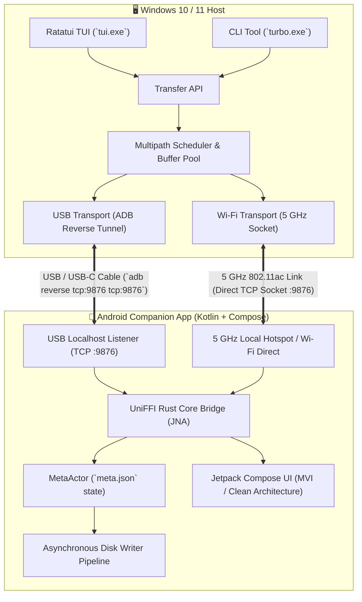

# 🚀 TurboTransfer

<div align="center">

**Ultra-High-Speed Multipath File Transfer Engine between Android & Windows**  
*Simultaneous USB (ADB Reverse Tunnel) + 5 GHz Wi-Fi Direct / Local Hotspot Transmission*

[](https://www.rust-lang.org/)
[](https://developer.android.com/)
[](https://developer.android.com/jetpack/compose)
[](https://www.microsoft.com/windows)
[](https://ratatui.rs/)
[](https://mozilla.github.io/uniffi-rs/)
[](LICENSE)
[](https://github.com/)

</div>

---

## 📖 Overview

**TurboTransfer** is an enterprise-grade, cross-platform file transfer system engineered specifically for massive payloads (4K/8K ProRes video, RAW photo libraries, disk images, game backups, and virtual machine snapshots) between Windows PCs and Android devices.

Unlike traditional transfer tools (MTP, Bluetooth, or single-channel HTTP/SMB servers) that are throttled by single-link bottlenecks and protocol overhead, TurboTransfer **bonds physical USB and high-speed 5 GHz Wi-Fi links into a unified multipath stream**. It pairs a stateful control plane with a stateless data plane of independently verifiable chunks, delivering maximum aggregate throughput, instant cold-resume recovery, and zero external router or internet dependencies.



---

## ⚡ Key Architectural Highlights

* **Multipath Bandwidth Aggregation**: Concurrently streams chunks across USB ADB tunnels and 5 GHz Wi-Fi Direct / Local Hotspot channels, dynamically rebalancing worker chunk allocation based on rolling throughput metrics.
* **Stateless Chunk Data Plane**: Large files are split into 64 MiB boundary-aligned chunks (configurable). Each chunk is prefixed with length framing, a 64-bit chunk index, and an **xxHash64** checksum for instantaneous per-chunk verification.
* **Crash-Resilient Cold Resume**: Governed by an asynchronous `MetaActor` persisting contiguous chunk bitmaps in `meta.json` on disk every 250 ms or 4 completed chunks. Transfers survive cable disconnects, process restarts, or OS power events without re-transmitting completed chunks.
* **Whole-File Integrity Validation**: Hardware-accelerated **CRC32c / SHA256** checksum verification runs before atomically renaming `.part` staging files to final destinations.
* **Zero Router / Zero Internet Requirement**: Direct Android Local-Only Hotspot (5 GHz SoftAp) or Wi-Fi Direct P2P Group Owner mode enables wire-speed transfers anywhere off the grid.
* **Clean Architecture Android App**: 100% Jetpack Compose Material 3 UI powered by Hilt, Kotlin Coroutines, StateFlow, kernel sysfs USB hardware probing, and automatic Wi-Fi/CPU WakeLocks.
* **Full 15-Screen Ratatui Terminal UI**: Complete terminal cockpit with 250 ms non-blocking asynchronous polling matching backend flush cycles, type-ahead search, device discovery, and diagnostics.
* **Automation-Friendly CLI (`turbo`)**: Fast, scriptable command-line interface with real-time rolling terminal progress bars for headless servers and power users.

---

## 📂 Project Architecture

```
TurboTransfer/
├── core/                               # Core Rust engine & wire protocol
│   ├── src/
│   │   ├── checksum/                   # xxHash64 & CRC32c integrity engines
│   │   ├── chunk/                      # 64 MiB chunk engine, boundary math, framing
│   │   ├── manifest/                   # File manifests, schema, MetaActor, meta.json
│   │   ├── protocol/                   # Wire framing, Message enums, Error types
│   │   ├── scheduler/                  # Multipath rate-adaptive scheduler, buffer pool
│   │   ├── transfer/                   # TransferSession, Transfer API, Tracker, Benchmarks
│   │   ├── transport/                  # USB (ADB), Wi-Fi Direct, TCP Stream abstractions
│   │   ├── turbotransfer_core.udl      # UniFFI interface definition
│   │   └── uniffi_interface.rs         # Native UniFFI FFI exports & Tokio runtime bridge
│   └── tests/                          # Protocol, chunk, actor, cold resume, multipath tests
├── tui/                                # Full 15-screen Ratatui Terminal User Interface
│   ├── src/
│   │   ├── app.rs                      # Decoupled TUI state & Transfer API client
│   │   ├── config.rs                   # TurboSettings JSON configuration model
│   │   ├── events.rs                   # Keyboard event dispatcher & global shortcuts
│   │   ├── main.rs                     # Terminal setup, loop, panic & Ctrl+C safety hooks
│   │   └── ui/                         # 15 distinct modular UI view renderers
├── cli/                                # Standalone CLI tool (`turbo`)
│   └── src/main.rs                     # Clap subcommand parser & streaming progress loop
├── transport/
│   ├── usb/                            # High-speed USB / ADB tunnel transport wrapper
│   └── wifi_direct/                    # Wi-Fi Direct P2P transport wrapper
├── windows/                            # Windows platform glue (ADB process & networking)
├── android/                            # Android companion application (Kotlin + Compose)
│   ├── app/src/main/
│   │   ├── java/com/turbotransfer/
│   │   │   ├── MainActivity.kt         # Edge-to-edge Compose activity
│   │   │   ├── TurboTransferApplication.kt # Hilt application root
│   │   │   ├── WifiHotspotManager.kt   # 5 GHz SoftAp & loopback control server
│   │   │   ├── core/                   # Common dispatchers, resources, TransferLockManager
│   │   │   ├── data/                   # Repositories, local/network data sources, RustCoreDataSource
│   │   │   ├── domain/                 # Models, repository interfaces, use cases
│   │   │   └── presentation/           # Compose screens (Send, Receive, Transfer, History, Settings)
│   │   ├── java/uniffi/                # Generated UniFFI Kotlin bindings
│   │   └── jniLibs/                    # Pre-compiled aarch64 & x86_64 Rust .so binaries
└── docs/                               # Architecture blueprints, TRD, benchmark logs
```

---

## 📱 1. Android Companion App

The Android companion application is built with **Clean Architecture + MVI/MVVM** principles using 100% **Jetpack Compose (Material 3)**, **Hilt Dependency Injection**, and **Kotlin Coroutines / StateFlow**.

```
┌─────────────────────────────────────────────────────────────┐
│                    Presentation Layer                       │
│    SendScreen │ ReceiveScreen │ TransferScreen │ History    │
├─────────────────────────────────────────────────────────────┤
│                       Domain Layer                          │
│   UseCases (Send, Receive, Hotspot, Discovery, Settings)    │
├─────────────────────────────────────────────────────────────┤
│                        Data Layer                           │
│  Repository Implementations │ Local Storage │ Network Probe │
├─────────────────────────────────────────────────────────────┤
│                    Native Bridge Layer                      │
│     UniFFI JNA Bridge ──► libturbotransfer_core.so (Rust)   │
└─────────────────────────────────────────────────────────────┘
```

### 📱 Main Tabs & Features

1. **Send Screen (`SendScreen.kt`)**:
   * **Quick Media Filters**: Instant one-tap access to *Photos*, *Videos*, *Audio*, *Documents*, *Folders*, and *Custom Files*.
   * **Storage Access Framework (SAF)**: Full support for multi-file document selection (`OpenMultipleDocuments`) and entire directory trees (`OpenDocumentTree`).
   * **Live Transfer Queue**: Dynamic list showing selected items, individual file sizes, and aggregate total payload size.
   * **Recipient & Transport Configuration**: Target IP input, paired device list, Wi-Fi Spike / Hotspot pairing helper, and transport preference selection (*Auto Multipath*, *Combined*, *USB Only*, *Wi-Fi Direct Only*).

2. **Receive Screen (`ReceiveScreen.kt`)**:
   * **Continuous Listener**: One-tap background server listening on `:9876`.
   * **Multi-Network Address Detection**: Live badges showing active IP endpoints:
     * USB ADB Loopback: `127.0.0.1:9876`
     * Wi-Fi Direct P2P: `192.168.49.1:9876`
     * 5 GHz Local Hotspot: `192.168.43.1:9876`
     * Local Wi-Fi Network IP
   * **Animated Radar Reception Indicator**: Clear visual feedback when in active listening mode.
   * **Integrated QR Code Pairing**: Generates an on-screen QR code encoding SSID, WPA2 passphrase, IP, and port for instant zero-config pairing with Windows.
   * **Custom Destination Directory**: Select any storage path (default: `/sdcard/Download`).

3. **Transfer Screen (`TransferScreen.kt`)**:
   * **Real-Time Speedometer & Gauges**: Live aggregate transfer speed in MB/s with dual-channel breakdown (USB speed vs. 5 GHz Wi-Fi speed).
   * **Chunk Progress & Matrix**: Visual progress bar tracking completed chunks, in-flight chunks, and total chunk count.
   * **Session Details**: Displays filename, file size, elapsed time, and calculated ETA.
   * **Interactive Controls**: Instant *Pause*, *Resume*, and *Cancel* actions.
   * **Completion Summary Card**: Post-transfer summary card with duration, average throughput, and quick dismiss.

4. **History Screen (`HistoryScreen.kt`)**:
   * Chronological list of completed, failed, and paused transfers.
   * Displays transfer direction (Sent/Received), formatted size, elapsed time, average throughput, and timestamp.
   * Status badges and one-tap history clearing.

5. **Settings Screen (`SettingsScreen.kt`)**:
   * **Device Identity**: Custom device name broadcasted to peers.
   * **5 GHz Band Enforcement (`SoftApConfiguration`)**: Forces 802.11ac 5 GHz band for Local Hotspots on Android 11+ (API 30+).
   * **High-Performance Lock Management (`TransferLockManager`)**: Prevents CPU throttling and Wi-Fi power-save sleep by acquiring `FULL_LOW_LATENCY` / `FULL_HIGH_PERF` WifiLocks and partial WakeLocks during active transfers.

---

## 🖥️ 2. Desktop Terminal UI (TUI)

The Terminal User Interface is built with **Ratatui 0.28** and **Crossterm**, featuring a decoupled architecture with a non-blocking **250 ms asynchronous polling loop** matching the Rust `MetaActor` disk flush frequency.

```
┌─────────────────────────────────────────────────────────────────────────────┐
│ 🚀 TurboTransfer TUI                                    [Mode: Multipath]   |
├─────────────────────────────────────────────────────────────────────────────┤
│  [1] Send Files        [3] Devices          [5] Benchmark                   │
│  [2] Receive Mode      [4] Transfers        [6] Settings                    │
├─────────────────────────────────────────────────────────────────────────────┤
│                                                                             │
│   Active Transfer: 4K_Video_Raw_Footage.mkv (12.80 GB)                      │
│   Progress: [██████████████████████████████░░░░░░] 76.4%                    │
│                                                                             │
│   Aggregate Speed : 84.2 MB/s                                               │
│   ├─ USB ADB  : 38.6 MB/s (127.0.0.1:9876)                                  │
│   └─ 5GHz Wi-Fi   : 45.6 MB/s (192.168.43.1:9876)                           │
│                                                                             │
│   Chunks Completed: 153 / 200 (64 MiB/chunk) | In-Flight: 4 | Retries: 0    │
│   Elapsed: 00:01:56 | ETA: 00:00:36                                         │
│                                                                             │
├─────────────────────────────────────────────────────────────────────────────┤
│ [P] Pause | [R] Resume | [C] Cancel | [D] Details | [1-6] Tabs | [Q] Quit   │
└─────────────────────────────────────────────────────────────────────────────┘
```

### 🎛️ Complete 15-Screen Matrix

| Screen | Identifier | Description | Key Navigation |
|---|---|---|---|
| **1** | `MainMenu` | Central dashboard hub with status and quick links | `1`–`6`, `Up`/`Down`, `Enter` |
| **2** | `SendFiles` | Initiate file transfer (file browser or direct path) | `B` (Browse), `P` (Path), `Enter` |
| **3** | `FileBrowser` | Interactive directory explorer with type-ahead search | `Up`/`Down`, `Enter` (Descend), `Backspace`/`Left` (Ascend), `Char` (Search) |
| **4** | `DeviceSelection` | Select target peer from auto-discovered ADB/Wi-Fi devices | `Up`/`Down`, `R` (Refresh), `Enter` |
| **5** | `TransportSelection` | Choose transport mode (*Auto*, *Combined*, *USB*, *Wi-Fi*) | `1`–`4`, `Up`/`Down`, `Enter` |
| **6** | `TransferScreen` | Live cockpit showing gauges, dual-speed meters, and ETA | `P` (Pause), `R` (Resume), `C` (Cancel), `D` (Details) |
| **7** | `TransferDetails` | Deep diagnostics: chunk matrix, error counters, socket state | `P` (Pause), `C` (Cancel), `Esc` (Back) |
| **8** | `ReceiveFiles` | Receiver standby dashboard; auto-transitions on incoming stream | `S` (Settings), `Esc` (Back) |
| **9** | `IncomingPrompt` | Security verification prompt for incoming transfers | `Enter` (Accept), `Esc` (Reject) |
| **10** | `Devices` | Discovered devices manager with connection health | `Up`/`Down`, `R` (Refresh), `S` (Send), `Enter` |
| **11** | `Transfers` | Tabbed transfer manager (*Current*, *Resumable*, *Completed*) | `Tab` / `Left`/`Right` (Switch tabs), `R` (Resume), `D` (Details), `C` (Cancel) |
| **12** | `Resume` | Cold resume picker for interrupted `.part` files | `Enter` (Resume Selected), `Esc` (Back) |
| **13** | `Benchmark` | Link stress-testing utility across customizable payloads (50 MB – 2 GB) | `Up`/`Down` (Transport), `S` (Cycle Size), `Enter` (Run) |
| **14** | `BenchmarkResults` | Benchmark scorecard with throughput metrics | `Esc` (Back), `M` (Main Menu) |
| **15** | `Settings` | 6 modular configuration tabs with persistent JSON storage | `Tab` / `Left`/`Right`, `1`–`6`, `Up`/`Down`, `Space`/`Enter` |

### ⌨️ Global TUI Shortcuts

* **`1` – `6`**: Jump directly to Main Menu screens (*Send*, *Receive*, *Devices*, *Transfers*, *Benchmark*, *Settings*).
* **`Up` / `Down` (or `k` / `j`)**: Navigate lists and menus.
* **`Enter` / `Right`**: Select item, descend into directory, confirm prompt.
* **`Backspace` / `Left`**: Ascend to parent directory, navigate back.
* **`P`**: Pause active transfer (flushes pending chunks and updates `meta.json`).
* **`R`**: Resume active or selected interrupted transfer (reads `meta.json` bitset).
* **`C`**: Cancel active transfer.
* **`D`**: Open in-depth transfer diagnostics and chunk matrix.
* **`Esc` / `Q`**: Back / Cleanly exit with guaranteed terminal restoration.
* **`Ctrl + C`**: Safe emergency exit with terminal raw mode rollback.

---

## ⚡ 3. Command-Line Interface (`turbo`)

The `turbo` CLI provides a lightweight, scriptable binary for automated pipelines, headless servers, and terminal power users.

```powershell
# Send a file using automatic multipath aggregation (USB + Wi-Fi Direct)
turbo send "D:\Backups\large_archive.tar.gz"

# Send over USB only via ADB tunnel
turbo send "D:\Movies\movie.mkv" --transport usb

# Send to a specific peer endpoint
turbo send "D:\Photos\photos.zip" --address 192.168.43.1:9876

# Enter continuous receive mode saving to custom destination
turbo receive --dest "D:\ReceivedFiles" --address 0.0.0.0:9876

# Discover available USB ADB devices and Wi-Fi peers
turbo discover

# List active, resumable, and completed transfers
turbo transfers

# Resume an interrupted transfer
turbo resume --transfer-id 4a7c1b52-9685-48b0-a54b-d7589d81d2f6

# Cancel an active transfer
turbo cancel 4a7c1b52-9685-48b0-a54b-d7589d81d2f6
```

### 📋 CLI Command Reference

| Subcommand | Options / Flags | Default | Description |
|---|---|---|---|
| `send <PATH>` | `--transport <auto\|combined\|usb\|wifi-direct>`<br>`--device <UUID>`<br>`--address <IP:PORT>` | `--transport auto`<br>`--address 127.0.0.1:9876` | Streams file to target peer with real-time rolling terminal speed, ETA, and progress bar |
| `receive` | `--dest <PATH>`<br>`--address <IP:PORT>` | `--dest .`<br>`--address 127.0.0.1:9876` | Starts continuous receive daemon accepting incoming connections |
| `discover` | — | — | Lists discovered USB ADB devices and active transport endpoints |
| `transfers` | — | — | Lists all current, resumable, and completed transfer sessions |
| `resume` | `[TRANSFER_ID]`<br>`--transport <auto\|combined\|usb\|wifi-direct>`<br>`--address <IP:PORT>` | `--transport auto` | Resumes an interrupted transfer from existing `.part` and `meta.json` |
| `cancel <ID>` | `<TRANSFER_ID>` | Required | Cancels an in-flight transfer session |

---

## 🛠️ Build & Installation Guide

### 1. Prerequisites

* **Windows Host**:
  * [Rust 1.75+](https://rustup.rs/) (Target: `x86_64-pc-windows-msvc`).
  * Android SDK Platform-Tools (`adb.exe` in `PATH`).
* **Android Development**:
  * Android Studio Hedgehog+ or Gradle 8.13+ (JDK 17).
  * Android NDK `r26` or later (`26.3.11579264`).
  * Rust Android Targets:
    ```powershell
    rustup target add aarch64-linux-android x86_64-linux-android
    ```

---

### 2. Building Desktop Binaries (TUI & CLI)

To compile both the interactive Ratatui TUI and the CLI tool in release mode:

```powershell
# Build entire desktop workspace
cargo build --release --workspace

# Compiled output binaries:
# - target/release/turbo.exe     (CLI binary)
# - target/release/tui.exe       (Interactive Ratatui TUI)
```

To run the TUI immediately:
```powershell
.\target\release\tui.exe
```

---

### 3. Building Android Companion App

#### Step A: Compile Native Core Library (`libturbotransfer_core.so`)
Configure the Android NDK Clang toolchain and compile the native Rust core library:

```powershell
# Set NDK toolchain path
$NDK_BIN = "D:\Android\sdk\ndk\26.3.11579264\toolchains\llvm\prebuilt\windows-x86_64\bin"
$env:CC_aarch64_linux_android = "$NDK_BIN\aarch64-linux-android34-clang.cmd"
$env:AR_aarch64_linux_android = "$NDK_BIN\llvm-ar.exe"
$env:CARGO_TARGET_AARCH64_LINUX_ANDROID_LINKER = "$NDK_BIN\aarch64-linux-android34-clang.cmd"

# Build Rust shared library for ARM64 (aarch64)
cargo build --release --target aarch64-linux-android -p turbotransfer-core

# Copy compiled .so to Android jniLibs
New-Item -ItemType Directory -Force -Path android\app\src\main\jniLibs\arm64-v8a
Copy-Item target\aarch64-linux-android\release\libturbotransfer_core.so android\app\src\main\jniLibs\arm64-v8a\libturbotransfer_core.so -Force
```

#### Step B: Generate UniFFI Kotlin Bindings (Optional / when core API updates)
```powershell
cargo run --bin uniffi-bindgen
```

#### Step C: Build & Install APK
```powershell
cd android
.\gradlew.bat installDebug
```

---

## 🔌 Connection & Transfer Scenarios

### Scenario A: USB Only (ADB Reverse Tunnel)
*Best for ultra-stable wired transfers with zero wireless setup.*

1. Connect Android phone to PC via USB / USB-C cable.
2. Enable **USB Debugging** on the phone.
3. Open **TurboTransfer** on Android $\rightarrow$ Tap **Receive** tab $\rightarrow$ Tap **Enter Receive Mode** (listens on `127.0.0.1:9876`).
4. On Windows:
   ```powershell
   # ADB tunnel is configured automatically by TUI/Core, or manually via:
   adb reverse tcp:9876 tcp:9876
   
   # Send file via CLI or TUI
   turbo send "C:\Videos\footage.mkv" --transport usb
   ```

---

### Scenario B: 5 GHz Wi-Fi Direct / Local Hotspot
*Best for fast wireless transfers without routers, local Wi-Fi networks, or internet.*

1. Open **TurboTransfer** on Android $\rightarrow$ Tap **Receive** tab.
2. Tap **Start 5 GHz Hotspot** $\rightarrow$ A QR code dialog appears on the phone.
3. Connect Windows PC to the displayed hotspot SSID with the provided passphrase.
4. On Windows, launch `tui.exe` or run:
   ```powershell
   turbo send "C:\Videos\footage.mkv" --address 192.168.43.1:9876 --transport wifi-direct
   ```

---

### Scenario C: Dual-Channel Multipath Bonding (USB + 5 GHz Wi-Fi)
*Maximizes throughput by bonding USB and 5 GHz Wi-Fi concurrently.*

1. Connect phone via USB cable and start Local Hotspot on phone.
2. Connect PC to the phone's 5 GHz Hotspot.
3. Open **TurboTransfer** on Android $\rightarrow$ **Receive** tab $\rightarrow$ **Enter Receive Mode**.
4. On Windows, launch `tui.exe` $\rightarrow$ Select file $\rightarrow$ Select **Auto (Multipath)** transport mode.
5. The scheduler dynamically balances chunks across both physical links simultaneously.

---

## ⚙️ Configuration (`settings.json`)

TUI and CLI configurations are stored in `%APPDATA%\turbotransfer\settings.json` (Windows) or `~/.config/turbotransfer/settings.json` (Linux/macOS):

```json
{
  "transport_preference": "Automatic",
  "p2p_band": "Prefer5GHz",
  "chunk_size_mb": 64,
  "verify_checksums": true,
  "max_inflight_chunks": 4,
  "buffer_pool_multiplier": 8,
  "download_dir": "C:\\Users\\neo\\Downloads",
  "disk_preallocation": true,
  "require_pin_pairing": false,
  "encryption_enabled": true,
  "theme": "Dark",
  "poll_interval_ms": 250
}
```

### Settings Schema

| Field | Type | Default | Description |
|---|---|---|---|
| `transport_preference` | String | `"Automatic"` | Default transport mode (`Automatic`, `Combined`, `UsbOnly`, `WifiDirectOnly`) |
| `p2p_band` | String | `"Prefer5GHz"` | Wireless band preference (`Prefer5GHz`, `Prefer2_4GHz`, `Auto`) |
| `chunk_size_mb` | Integer | `64` | Size of individual transfer chunks in MiB |
| `verify_checksums` | Boolean | `true` | Enforce xxHash64 per-chunk and CRC32c whole-file validation |
| `max_inflight_chunks` | Integer | `4` | Max concurrent unacknowledged chunks per transport |
| `buffer_pool_multiplier`| Integer | `8` | Number of pre-allocated chunk buffers in memory pool |
| `download_dir` | String | System default | Default directory for saving received files |
| `disk_preallocation` | Boolean | `true` | Pre-allocate destination file size on disk (`.part` staging) |
| `poll_interval_ms` | Integer | `250` | Progress polling and `MetaActor` flush frequency |

---

## 🧪 Automated Testing Suite

TurboTransfer includes unit, integration, and stress tests verifying wire framing, chunk mathematics, MetaActor single-writer safety, cold resume recovery, and multipath scheduling:

```powershell
# Run all workspace unit and integration tests
cargo test --workspace
```

### Verified Test Matrix

* **`chunk_tests`**: Chunk boundary math, zero-byte and single-byte edge cases, remainder calculations, xxHash64 & CRC32c reference vectors.
* **`actor_tests`**: Single-writer `MetaActor` range coalescing, batching flush thresholds, and crash recovery.
* **`cold_resume_tests`**: Process crash simulation mid-transfer with 100% byte-for-byte SHA256 integrity verification.
* **`multipath_tests`**: Single transport drop resilience, duplicate ACK idempotence, chunk NACK requeue/retry, out-of-order chunk assembly.
* **`protocol_tests`**: Wire framing, length prefix validation, message serialization roundtrips, malformed frame protection.
* **`tcp_transport_tests`**: Direct frame exchanges, disconnect handling, wildcard binding, bidirectional transfers.
* **`tui_tests`**: Full 15-screen reachability audit, keyboard navigation, file browser navigation, and settings JSON roundtrip serialization.

---

## 📄 License

This project is licensed under the [MIT License](LICENSE).
