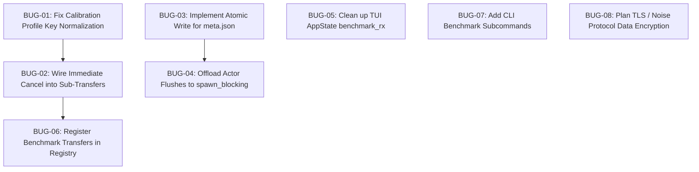

# TurboTransfer — Identified Bugs, Architectural Defects & Technical Debt

**Date:** September 7, 2026  
**Target Reference:** [`turbotransfer_trd.md`](./turbotransfer_trd.md) | [`benchmark-calibration-implementation-plan.md`](./benchmark-calibration-implementation-plan.md)  
**Status:** Audit Findings Report  

---

## 1. Executive Summary & Defect Severity Matrix

During a code audit of the TurboTransfer codebase—focusing on the newly implemented **Hardware Benchmark & Link Calibration Subsystem** (`core/src/benchmark/`), the **Single-Writer Manifest Actor** (`core/src/manifest/actor.rs`), the **Multipath Data Plane** (`core/src/transfer/`), **Desktop TUI** (`tui/`), and **Android Settings Presentation** (`android/`)—several critical defects, race conditions, and architectural inconsistencies were identified.

| Bug ID | Severity | Category | Affected Subsystem | Summary |
|---|---|---|---|---|
| **BUG-01** | **HIGH** | Functional / Persistence | `core::benchmark`, `api`, `android` | Calibration profile orphaned under default address; cancellation silently fails |
| **BUG-02** | **HIGH** | Responsiveness / Cancellation | `core::benchmark`, `transfer::session` | Calibration sub-transfers block cancellation mid-stream until 250 MB transfer finishes |
| **BUG-03** | **HIGH** | Data Integrity / Resilience | `core::manifest::actor` | `MetaActor` performs non-atomic writes to `meta.json`, risking crash corruption and progress loss |
| **BUG-04** | **MEDIUM** | Performance / Async Runtime | `core::manifest::actor` | Synchronous blocking disk I/O executed inside async Tokio actor message loop |
| **BUG-05** | **MEDIUM** | Resource Leak / Hygiene | `tui::app` | `benchmark_rx` receiver retained after completion, causing redundant polling |
| **BUG-06** | **MEDIUM** | Observability / Control | `core::benchmark::runner`, `transfer::api` | Benchmark transfers omitted from global transfer registry, breaking pause/cancel APIs |
| **BUG-07** | **LOW** | Feature Parity | `cli::main` | `turbo` CLI lacks `benchmark` and `calibrate` subcommands present in TUI and Android |
| **BUG-08** | **LOW** | Security (TRD §11) | `core::protocol`, `transport` | Plaintext wire data plane across Local Hotspot / Wi-Fi Direct connections |

---

## 2. In-Depth Bug Reports & Remediation

---

### BUG-01: Calibration Profile Orphaned & Cancellation Failure under Default / Auto-detect Address

* **Severity:** **HIGH**
* **Location:**
  * `core/src/benchmark/calibration.rs:40-44, 276`
  * `core/src/benchmark/config_store.rs:16-27, 29-48`
  * `core/src/transfer/api.rs:704-714`
  * `android/app/src/main/java/com/turbotransfer/presentation/settings/SettingsViewModel.kt:83-122`

#### Root Cause Analysis
When running calibration without an explicit peer address (the standard workflow when auto-detecting an ADB USB peer or default Wi-Fi gateway), Android passes `address = null` (via `addr.takeIf { it.isNotBlank() }`).

In `core/src/benchmark/calibration.rs`:
```rust
let target_id = target_device_id.unwrap_or_else(Uuid::new_v4);
let target_key = address
    .map(|s| s.to_string())
    .unwrap_or_else(|| target_id.to_string());
```
Because `address` is `None` and `target_device_id` is `None`, `target_key` is assigned a freshly generated, random UUID (e.g. `"f47ac10b-58cc-4372-a567-0e02b2c3d479"`).

Upon completion of the 10 sweep steps, the winning configuration is saved to disk:
```rust
let _ = save_calibration(target_key, winning_config.clone(), best_speed_mbps);
```
This writes `%APPDATA%/turbotransfer/calibration/f47ac10b-58cc-4372-a567-0e02b2c3d479.json`.

However, during normal transfers (`start_transfer` in `core/src/transfer/api.rs`), the key lookup logic is:
```rust
let peer_key = address
    .as_deref()
    .or_else(|| device_id.map(|_| ""))
    .unwrap_or("");
let saved_cal = if let Some(did) = device_id {
    crate::benchmark::get_saved_calibration(&did.to_string())
        .or_else(|| crate::benchmark::get_saved_calibration(peer_key))
} else {
    crate::benchmark::get_saved_calibration(peer_key)
};
```
When `peer_key` is `""`, `config_store::get_pair_key("")` normalizes the key to `"default_peer"`. It searches for `"default_peer.json"`, which does **not** exist because the file was written with the random UUID. The calibrated profile is never applied.

**Cancellation Impact:**  
In `ACTIVE_CALIBRATIONS`:
```rust
map.insert(target_key.to_string(), cancel_token.clone());
```
The token is keyed by the random UUID. When Android calls `cancelCalibration()`:
```kotlin
fun cancelCalibration() {
    val addr = _uiState.value.targetAddress // ""
    cancelCalibration(addr)
}
```
Rust executes `cancel_calibration("")`:
```rust
if let Some(token) = map.get(target_key) {
    token.store(true, Ordering::SeqCst);
}
```
Because `""` does not match the random UUID in `map`, the token is never located and never flipped to `true`. Cancellation silently fails.

#### Concrete Fix
In `core/src/benchmark/calibration.rs`, normalize blank or missing keys to `"default_peer"`:
```rust
let target_key = match address.map(|s| s.trim()).filter(|s| !s.is_empty()) {
    Some(addr) => addr.to_string(),
    None => target_device_id
        .map(|id| id.to_string())
        .unwrap_or_else(|| "default_peer".to_string()),
};
```
In `android/app/src/main/java/com/turbotransfer/presentation/settings/SettingsViewModel.kt`:
Pass the normalized key or empty string consistently across `runCalibration`, `cancelCalibration`, and `loadSavedCalibration`.

---

### BUG-02: Calibration Sub-Transfer Mid-Stream Cancellation Blocked

* **Severity:** **HIGH**
* **Location:**
  * `core/src/benchmark/calibration.rs:80-86, 111-119, 160-168, 212-220, 256-264`
  * `core/src/benchmark/runner.rs:50-61`

#### Root Cause Analysis
In `run_calibration_internal`, cancellation is checked via:
```rust
let check_cancel = || -> Result<(), TransferSessionError> {
    if cancel_token.load(Ordering::Relaxed) {
        Err(TransferSessionError::Cancelled)
    } else {
        Ok(())
    }
};
```
`check_cancel()?` is **only invoked between stages**. Inside each stage, `run_benchmark_transfer` is called:
```rust
let res = run_benchmark_transfer(
    Some(target_id),
    address,
    TransportPreference::Combined,
    250,
    Some(&config),
    TransferPurpose::Calibration,
).await?;
```
`run_benchmark_transfer` spawns a 250 MB transfer via `send_file_session_multipath_ext`. At ~30–50 MB/s, this transfer takes **5–8 seconds**. If the user clicks "Cancel" 1 second into step 2, the `cancel_token` is set to `true`, but `send_file_session_multipath_ext` has no awareness of `cancel_token`.

The sub-transfer continues transferring data across the network until the entire 250 MB payload finishes before `run_calibration_internal` checks `check_cancel()?`. If the link is degraded, the user can be stuck waiting up to 30+ seconds for a cancellation to register.

#### Concrete Fix
1. Store the active sub-transfer `transfer_id` inside an `Arc<Mutex<Option<Uuid>>>` shared with `ACTIVE_CALIBRATIONS`.
2. In `cancel_calibration(target_key)`:
```rust
if let Some((token, active_tx_id)) = map.get(target_key) {
    token.store(true, Ordering::SeqCst);
    if let Some(tx_id) = *active_tx_id.lock() {
        crate::transfer::api::cancel_transfer(tx_id);
    }
}
```
3. Register the sub-transfer in `registry.transfers` so `transfer_control_status` aborts the inner sliding window loop immediately.

---

### BUG-03: `MetaActor` Non-Atomic File Overwrite Risks Corruption on Crash

* **Severity:** **HIGH**
* **Location:** `core/src/manifest/actor.rs:151-179`

#### Root Cause Analysis
In `MetaActor::flush_sync` and `flush_async`:
```rust
if let Ok(json) = serde_json::to_string_pretty(&self.meta) {
    let _ = fs::write(&self.meta_path, json);
}
```
`fs::write` truncates and rewrites the destination file in place. If an Android OS low-memory kill (OOM), power cut, or PC power interruption occurs while `fs::write` is executing, `meta.json` is left partially written or corrupted (zero-byte or invalid JSON).

When the transfer is resumed after reboot, `MetaActor::spawn` attempts to recover:
```rust
let (meta, completed_set) = if meta_path.exists() {
    match fs::read_to_string(&meta_path) {
        Ok(content) => match serde_json::from_str::<TransferMeta>(&content) {
            Ok(loaded_meta) => (loaded_meta, expand_ranges(&loaded_meta.completed_ranges)),
            Err(_) => (initial_meta, HashSet::new()),
        },
        Err(_) => (initial_meta, HashSet::new()),
    }
};
```
Because `serde_json::from_str` fails on corrupted JSON, `MetaActor` falls back to `HashSet::new()`, completely discarding all previously completed chunks. A 50 GB transfer that was 90% complete will restart from chunk 0.

#### Concrete Fix
Implement atomic file replacement via a temporary file and atomic rename:
```rust
fn flush_atomic(&self, path: &Path, json: &str) -> std::io::Result<()> {
    let tmp_path = path.with_extension("tmp");
    fs::write(&tmp_path, json)?;
    fs::rename(&tmp_path, path)?;
    Ok(())
}
```
On Windows and Linux/POSIX, `rename` over an existing file is atomic within the same filesystem.

---

### BUG-04: Synchronous Blocking Disk I/O Inside Async Tokio Actor Loop

* **Severity:** **MEDIUM**
* **Location:** `core/src/manifest/actor.rs:244-255`

#### Root Cause Analysis
In `MetaActor::handle_message`:
```rust
ActorMessage::ChunkFailed { transport, .. } => {
    ...
    self.dirty_events += 1;
    if self.dirty_events >= 10 {
        self.flush_sync();
    }
    false
}
ActorMessage::TransportStatusChanged { .. } => {
    self.dirty_events += 1;
    if self.dirty_events >= 10 {
        self.flush_sync();
    }
    false
}
```
`self.flush_sync()` performs direct synchronous `fs::write` disk operations:
```rust
fn flush_sync(&mut self) {
    ...
    if let Ok(json) = serde_json::to_string_pretty(&self.meta) {
        let _ = fs::write(&self.meta_path, json);
    }
    self.dirty_events = 0;
}
```
Because `handle_message` is invoked directly inside `MetaActor::run()` on a Tokio async worker thread (`actor.run().await`), synchronous filesystem writes block the Tokio runtime executor thread. Under slow storage conditions (such as external SD cards or congested flash), this introduces latency spikes in concurrent socket event handling.

While regular completed chunks are flushed via `self.flush_async().await` (which uses `tokio::task::spawn_blocking`), failure and status change branches bypass the async offload.

#### Concrete Fix
Unify all threshold flushes through `self.flush_async().await`, reserving `flush_sync()` exclusively for the initial actor setup before the async loop starts.

---

### BUG-05: TUI `benchmark_rx` Channel Receiver Retained After Completion

* **Severity:** **MEDIUM**
* **Location:** `tui/src/app.rs:431-445`

#### Root Cause Analysis
In `AppState::poll_active_progress`:
```rust
if let Some(ref mut rx) = self.benchmark_rx {
    if let Ok(res) = rx.try_recv() {
        self.is_benchmarking = false;
        match res {
            Ok(b) => {
                self.benchmark_result = Some(b);
                self.status_message = Some("Benchmark completed successfully".to_string());
                self.navigate_to(Screen::BenchmarkResults);
            }
            Err(e) => {
                self.status_message = Some(format!("Benchmark failed: {}", e));
            }
        }
    }
}
```
When `rx.try_recv()` succeeds and yields the final result, `self.is_benchmarking` is cleared, but `self.benchmark_rx` is **never reset to `None`**.

Every subsequent 250 ms tick, `poll_active_progress` executes `rx.try_recv()`. While `try_recv()` returns `Err(TryRecvError::Empty)` or `Err(TryRecvError::Disconnected)` without crashing, leaving stale channels open violates state machine hygiene and leaks the channel receiver.

#### Concrete Fix
Set `self.benchmark_rx = None;` inside both `Ok` and `Err` completion branches:
```rust
if let Some(mut rx) = self.benchmark_rx.take() {
    match rx.try_recv() {
        Ok(res) => {
            self.is_benchmarking = false;
            match res {
                Ok(b) => {
                    self.benchmark_result = Some(b);
                    self.status_message = Some("Benchmark completed successfully".to_string());
                    self.navigate_to(Screen::BenchmarkResults);
                }
                Err(e) => {
                    self.status_message = Some(format!("Benchmark failed: {}", e));
                }
            }
        }
        Err(tokio::sync::mpsc::error::TryRecvError::Empty) => {
            self.benchmark_rx = Some(rx);
        }
        Err(tokio::sync::mpsc::error::TryRecvError::Disconnected) => {
            self.is_benchmarking = false;
        }
    }
}
```

---

### BUG-06: Unregistered Benchmark Transfers in Global Transfer Registry

* **Severity:** **MEDIUM**
* **Location:**
  * `core/src/benchmark/runner.rs:28-61`
  * `core/src/transfer/session.rs:467-479, 707`
  * `core/src/transfer/api.rs:185-189`

#### Root Cause Analysis
In `run_benchmark_transfer`:
```rust
let transfer_id = Uuid::new_v4();
...
let res = send_file_session_multipath_ext(
    Uuid::new_v4(),
    "TurboBenchmark",
    &ephemeral.path,
    chunk_size,
    transfer_id,
    transports,
    Some("benchmark_payload.bin"),
    session_options,
).await;
```
Unlike `start_transfer` in `core/src/transfer/api.rs`, `run_benchmark_transfer` does not register `transfer_id` in `registry.transfers`.

Consequently:
1. `transfer_control_status(transfer_id)` in `core/src/transfer/api.rs` returns `None`.
2. Inside `send_file_session_multipath_ext`:
   ```rust
   match transfer_control_status(transfer_id) {
       Some(TransferStatus::Paused) => { ... }
       Some(TransferStatus::Cancelled) => { ... }
       _ => {}
   }
   ```
   The control check will never trigger because the transfer is not present in the registry.
3. If an external caller attempts to invoke `cancel_transfer(transfer_id)` or check `get_progress(transfer_id)`, the registry reports no active transfer.

#### Concrete Fix
Call `register_active_transfer` inside `run_benchmark_transfer` with an ephemeral marker, and remove it from the registry when the benchmark finishes.

---

### BUG-07: `turbo` CLI Lacks Benchmark and Calibration Subcommands

* **Severity:** **LOW**
* **Location:** `cli/src/main.rs:35-108`

#### Root Cause Analysis
The Ratatui TUI (`tui/`) and Android companion app (`android/`) have dedicated screens and viewmodels for running benchmarks and parameter calibration sweeps. However, the command-line interface `turbo` only implements:
* `send`
* `receive`
* `discover`
* `transfers`
* `log`
* `logs`
* `cancel`
* `resume`

Users on headless servers, automated testing rigs, or script pipelines cannot initiate raw link benchmarks or calibration sweeps using the CLI.

#### Concrete Fix
Add `Benchmark` and `Calibrate` subcommands to `Commands` enum in `cli/src/main.rs`, mapping directly to `turbotransfer_core::benchmark::run_benchmark` and `run_calibration`.

---

### BUG-08: Unencrypted Wire Data Plane Across SoftAp / Wi-Fi Direct Links

* **Severity:** **LOW** (Security Compliance Gap per TRD §11)
* **Location:** `core/src/protocol/frame.rs`, `core/src/transport/wifi_direct.rs`

#### Root Cause Analysis
Per TRD §11 ("Security & Pairing Architecture"), transfer payloads must be cryptographically protected against eavesdropping. 

While USB transfers are physically confined to the cable and guarded by ADB RSA host key authentication, Local Hotspot SoftAp links transmit unencrypted length-prefixed bincode frames over TCP port 9876. Although the Wi-Fi network itself is protected by WPA2-PSK (generated via `WifiHotspotManager.kt`), any rogue device that obtains the hotspot credentials or operates in promiscuous monitor mode on the same 802.11ac channel can reconstruct chunks.

#### Concrete Fix (Roadmap)
Implement TLS 1.3 or a Noise Protocol framework handshake (`Noise_XX_25519_ChaChaPoly_BLAKE2s`) authenticated via a 6-digit numeric PIN exchange during the initial `Hello` frame.

---

## 3. Prioritized Action Plan



1. **Immediate Patch (P0)**:
   * Fix BUG-01 by normalizing missing peer addresses to `"default_peer"` in `core/src/benchmark/calibration.rs` and `SettingsViewModel.kt`.
   * Fix BUG-03 by replacing `fs::write` in `MetaActor` with atomic tempfile write + rename to guarantee crash-resilient cold resumes.
2. **Short-Term Hardening (P1)**:
   * Fix BUG-02 and BUG-06 by registering sub-transfers in `registry.transfers` and wiring `cancel_transfer` to `cancel_calibration`.
   * Fix BUG-05 in `tui/src/app.rs` by resetting `benchmark_rx = None` on terminal delivery.
   * Fix BUG-04 by replacing blocking `flush_sync()` calls in `MetaActor::handle_message` with async offloading.
3. **Enhancement (P2)**:
   * Implement BUG-07 CLI commands (`turbo bench`, `turbo calibrate`).
   * Architect BUG-08 payload encryption layer.
