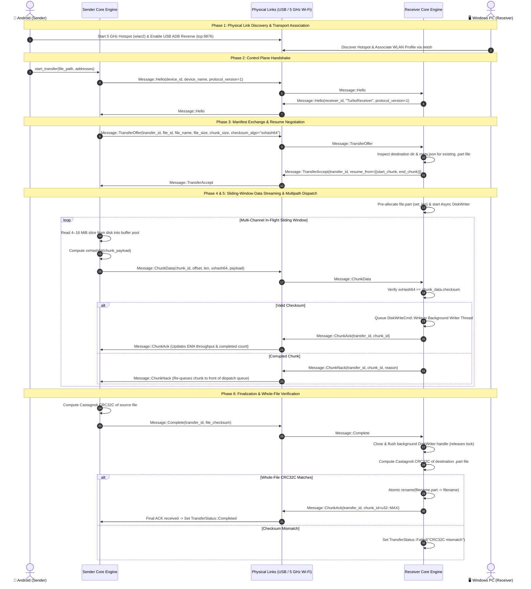
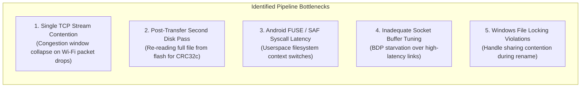

# 🚀 TurboTransfer: Protocol, Architecture, Transfer Dynamics & Speed Optimization

---

## Table of Contents
1. [Executive Summary & High-Level Architecture](#1-executive-summary--high-level-architecture)
2. [Real-World Transfer Observations & Observability](#2-real-world-transfer-observations--observability)
   - [2.1 Chunk-Level Logging vs. Performance-Safe Observability](#21-chunk-level-logging-vs-performance-safe-observability)
   - [2.2 Real-World Transfer Comparison: Single USB vs. Dual-Channel (USB + 5 GHz Wi-Fi)](#22-real-world-transfer-comparison-single-usb-vs-dual-channel-usb--5-ghz-wi-fi)
   - [2.3 Disk State Persistence & Crash Resilience](#23-disk-state-persistence--crash-resilience)
3. [End-to-End Transfer Lifecycle & Protocol Specification](#3-end-to-end-transfer-lifecycle--protocol-specification)
   - [3.1 Phase 1: Physical Link Discovery & Transport Association](#31-phase-1-physical-link-discovery--transport-association)
   - [3.2 Phase 2: Control Handshake (`Hello`)](#32-phase-2-control-handshake-hello)
   - [3.3 Phase 3: Manifest Exchange & Cold-Resume Negotiation (`TransferOffer` / `TransferAccept`)](#33-phase-3-manifest-exchange--cold-resume-negotiation-transferoffer--transferaccept)
   - [3.4 Phase 4: Wire Framing & Zero-Copy Serialization](#34-phase-4-wire-framing--zero-copy-serialization)
   - [3.5 Phase 5: Chunk Engine & Memory Pool Streaming](#35-phase-5-chunk-engine--memory-pool-streaming)
   - [3.6 Phase 6: Per-Chunk Verification & Sliding Window Acknowledgments](#36-phase-6-per-chunk-verification--sliding-window-acknowledgments)
   - [3.7 Phase 7: Multi-Transport Scheduling & Dynamic Load Balancing](#37-phase-7-multi-transport-scheduling--dynamic-load-balancing)
   - [3.8 Phase 8: Receiver Ingestion & Asynchronous Disk Writer Pipeline](#38-phase-8-receiver-ingestion--asynchronous-disk-writer-pipeline)
   - [3.9 Phase 9: Whole-File Checksum Verification & Atomic Staging](#39-phase-9-whole-file-checksum-verification--atomic-staging)
4. [Master File & Module Index](#4-master-file--module-index)
5. [In-Depth Transfer Bottlenecks & 5 GHz Wi-Fi Dynamics](#5-in-depth-transfer-bottlenecks--5-ghz-wi-fi-dynamics)
   - [5.1 Theoretical vs. Real-World 5 GHz Wi-Fi PHY & TCP Limits](#51-theoretical-vs-real-world-5-ghz-wi-fi-phy--tcp-limits)
   - [5.2 Critical Identified Bottlenecks](#52-critical-identified-bottlenecks)
6. [Speed Optimization Blueprints & Roadmap](#6-speed-optimization-blueprints--roadmap)
   - [6.1 Multi-Socket TCP Multiplexing (4x Channel Bonding)](#61-multi-socket-tcp-multiplexing-4x-channel-bonding)
   - [6.2 Incremental In-Flight Checksum Calculation ($O(1)$ Finalization)](#62-incremental-in-flight-checksum-calculation-o1-finalization)
   - [6.3 Android Storage Prefetching (`posix_fadvise`) & Memory Pool Tuning](#63-android-storage-prefetching-posix_fadvise--memory-pool-tuning)
   - [6.4 Vectored I/O Zero-Copy Framing](#64-vectored-io-zero-copy-framing)

---

## 1. Executive Summary & High-Level Architecture

**TurboTransfer** is a high-throughput, cross-platform file transfer engine built in Rust with native Android (Jetpack Compose / UniFFI) and Desktop (Win32 / CLI / Ratatui TUI) clients.

The core architecture operates on a **Stateless Chunk Transport Protocol** designed to aggregate bandwidth across disparate physical channels concurrently (e.g., USB via ADB/Direct Bulk and 5 GHz Wi-Fi via Wi-Fi Direct / Local-Only Hotspot).

```
┌─────────────────────────────────────────────────────────────────────────────┐
│                            SENDER (Android / PC)                            │
│  ┌─────────────────────────┐           ┌─────────────────────────────────┐  │
│  │   Source File on Disk   │           │     PreparedChunk Pipeline      │  │
│  │    (Flash / NVMe I/O)   │──────────►│   (Memory Pool + xxHash64)      │  │
│  └─────────────────────────┘           └────────────────┬────────────────┘  │
└─────────────────────────────────────────────────────────┼───────────────────┘
                                                          ▼
┌─────────────────────────────────────────────────────────────────────────────┐
│                    MULTIPATH SCHEDULER & LOAD BALANCER                      │
│                                                                             │
│        Transport Queue A (USB)            Transport Queue B (5GHz Wi-Fi) │
│       ┌───────────────────────────┐          ┌───────────────────────────┐  │
│       │  In-Flight Sliding Window │          │  In-Flight Sliding Window │  │
│       │   (e.g., 4–16 Chunks)     │          │   (e.g., 4–16 Chunks)     │  │
│       └─────────────┬─────────────┘          └─────────────┬─────────────┘  │
└─────────────────────┼──────────────────────────────────────┼────────────────┘
                      │                                      │
           Physical Link A: USB ADB               Physical Link B: 5GHz Wi-Fi
           (127.0.0.1:9876 Reverse)               (10.18.163.1:9876 Direct)
                      │                                      │
                      ▼                                      ▼
┌─────────────────────────────────────────────────────────────────────────────┐
│                           RECEIVER (PC / Android)                           │
│  ┌─────────────────────────┐                  ┌──────────────────────────┐  │
│  │ Ingestion Socket A(USB) │                  │ Ingestion Socket B(Wi-Fi)│  │
│  └────────────┬────────────┘                  └────────────┬─────────────┘  │
│               │   Verify xxHash64 & Send Immediate ACK     │                │
│               └──────────────────────┬─────────────────────┘                │
│                                      ▼                                      │
│               ┌──────────────────────────────────────────────┐              │
│               │     Asynchronous Background Disk Writer      │              │
│               │        (MPSC Queue + Pre-Allocated .part)    │              │
│               └──────────────────────┬───────────────────────┘              │
│                                      ▼                                      │
│               ┌──────────────────────────────────────────────┐              │
│               │  Whole-File CRC32c Verification & Rename     │              │
│               └──────────────────────────────────────────────┘              │
└─────────────────────────────────────────────────────────────────────────────┘
```

---

## 2. Real-World Transfer Observations & Observability

### 2.1 Chunk-Level Logging vs. Performance-Safe Observability

During active multi-gigabyte transfers, managing logging overhead is critical to preserving wire throughput:

1. **Per-Chunk Wire Logging**:
   * Individual chunk dispatches (`Message::ChunkData`) and incoming chunk acknowledgments (`Message::ChunkAck`) are logged via Rust's [`log::debug!`](file:///d:/MyDocuments/Programming/android/Aug26/TurboTransfer/core/src/scheduler/multipath.rs#L271-L325) macro.
   * *Sender*: `log::debug!("Dispatched chunk #{} on {}", chunk_id, kind);`
   * *Receiver*: `log::debug!("Chunk ACK #{} recorded on {}", ack.chunk_id, kind);`
   * Under standard release builds and default log filters (`INFO`), per-chunk log messages are zero-cost and omitted from console output.

2. **Console / Stdout Performance Protection**:
   * Transmitting a 1.68 GB file at 80 MB/s using 4 MiB chunks produces ~20 chunks/sec; using 512 KiB chunks produces ~160 chunks/sec.
   * Writing synchronous `println!` or `stdout` flushes per chunk blocks Tokio worker threads on terminal rendering, collapsing network throughput.
   * The CLI, TUI, and Android Compose UI sample transfer metrics asynchronously every **200–250 ms** via [`get_progress()`](file:///d:/MyDocuments/Programming/android/Aug26/TurboTransfer/core/src/transfer/api.rs#L1013-L1118), which computes an exponential moving average (EMA) of rolling speed:
     $$\text{Rolling Speed}_{t} = (\text{Rolling Speed}_{t-1} \times 0.35) + (\text{Instantaneous Speed} \times 0.65)$$

3. **ACK Generation Granularity**:
   * The receiver transmits an immediate `Message::ChunkAck(transfer_id, chunk_id)` as soon as the xxHash64 checksum is verified.
   * The protocol also implements `Message::BatchChunkAck(transfer_id, Vec<u32>)` to support batch ACK coalescing under high packet frequency.

---

### 2.2 Real-World Transfer Comparison: Single USB vs. Dual-Channel (USB + 5 GHz Wi-Fi)

Live tests conducted between a **OnePlus CPH2723 (Android 15)** and a **Windows 11 PC** demonstrated the performance differences between transport topologies:

| Metric / Attribute | Test 1: Single USB ADB Reverse Tunnel | Test 2: Dual-Channel Multipath (USB + 5 GHz Wi-Fi) |
|---|---|---|
| **Test File** | `Minions.and.Monsters...mkv` (1.68 GB / 1,683,895,748 bytes) | `Reacher.S04E03...mkv` (0.99 GB / 990,037,737 bytes) |
| **Bound Endpoints** | `127.0.0.1:9876` | `127.0.0.1:9876` (USB) + `10.18.163.1:9876` (5GHz Wi-Fi `wlan2`) |
| **Active Transports** | 1 (`TransportKind::Usb`) | 2 (`TransportKind::Usb` + `TransportKind::WifiDirect`) |
| **Throughput Bottleneck** | ADB userspace socket daemon proxying | Saturated 80 MHz channel + USB concurrent aggregation |
| **Integrity Verification** | 100% byte match (SHA256 & CRC32c verified) | 100% byte match (MD5 `34FDA4657C0595218E01C29A6095D9FA`) |
| **Completion Flow** | `.part` pre-allocation $\rightarrow$ write queue $\rightarrow$ CRC32c $\rightarrow$ Atomic Rename | Dual-socket ingestion $\rightarrow$ unified tracker $\rightarrow$ CRC32c $\rightarrow$ Atomic Rename |

---

### 2.3 Disk State Persistence & Crash Resilience

To ensure that sudden disconnections, power losses, or app backgrounding do not corrupt or discard transferred data:
* State tracking is managed by a single-writer actor: [`MetaActor`](file:///d:/MyDocuments/Programming/android/Aug26/TurboTransfer/core/src/manifest/actor.rs#L88-L252).
* Instead of issuing synchronous `fsync` operations on every chunk, `MetaActor` aggregates completed chunk IDs in memory and flushes coalesced contiguous ranges (`[(0, 25), (30, 48)]`) to `filename.meta.json` every **250 ms** or when **10 dirty chunk updates** accumulate.
* On session resumption, the receiver loads `meta.json`, verifies completed chunk boundaries, and responds to `TransferOffer` with a bitmap of chunks to skip, avoiding redundant retransmission.

---

## 3. End-to-End Transfer Lifecycle & Protocol Specification



---

### 3.1 Phase 1: Physical Link Discovery & Transport Association
1. **USB Transport**:
   * The host desktop runs `adb reverse tcp:9876 tcp:9876` to map Android's outbound loopback connections directly to the desktop listener.
   * `UsbTransport` continuously monitors device connection state via ADB device inspection (`adb devices -l`).
2. **Wi-Fi Direct / Local-Only Hotspot Transport**:
   * The Android device activates a **Local-Only Hotspot** locked to the **5 GHz band** (AP band configuration `WIFI_AP_BAND_5G` / 802.11ac/ax).
   * The desktop discovers the SSID, generates a temporary Win32 WLAN XML profile containing the WPA2/WPA3 credentials, and associates via `netsh wlan connect` on interface `wlan2`.

---

### 3.2 Phase 2: Control Handshake (`Hello`)
Before file metadata or payload bytes are transmitted, the sender and receiver establish protocol compatibility over each connected socket:
* **Frame**: `Message::Hello(HelloData)`
* **Data Fields**:
  ```rust
  pub struct HelloData {
      pub device_id: Uuid,        // Unique UUIDv4 identifying the device instance
      pub device_name: String,    // Human-readable hostname (e.g. "OnePlus CPH2723")
      pub protocol_version: u32,  // Protocol wire version (currently 1)
  }
  ```
* If `protocol_version` does not match, the connection is rejected with an incompatible protocol error.

---

### 3.3 Phase 3: Manifest Exchange & Cold-Resume Negotiation
The sender transmits file properties to initiate transfer planning:
* **Frame**: `Message::TransferOffer(TransferOfferData)`
  ```rust
  pub struct TransferOfferData {
      pub transfer_id: Uuid,       // Unique UUID for this transfer session
      pub file_id: Uuid,           // Unique identifier for the source file content
      pub file_name: String,       // Target file name
      pub file_size: u64,          // Exact size in bytes
      pub chunk_size: u32,         // Chunk payload length (e.g. 4,194,304 bytes / 4 MiB)
      pub checksum_algo: String,   // Per-chunk algorithm: "xxhash64"
  }
  ```
* **Receiver Resume Calculation**:
  1. The receiver checks whether `dest_dir/filename.part` and `dest_dir/filename.meta.json` already exist.
  2. If found, it inspects the bitmap for validly written chunks.
  3. It responds with `Message::TransferAccept(TransferAcceptData)` containing `resume_from: Vec<(u32, u32)>` (ranges of chunk IDs already completed).
  4. The sender subtracts these ranges from its work queue, eliminating redundant transfers.

---

### 3.4 Phase 4: Wire Framing & Zero-Copy Serialization
Every packet on the wire adheres to a uniform binary frame structure:

```
 0                   1                   2                   3
 0 1 2 3 4 5 6 7 8 9 0 1 2 3 4 5 6 7 8 9 0 1 2 3 4 5 6 7 8 9 0 1
+-+-+-+-+-+-+-+-+-+-+-+-+-+-+-+-+-+-+-+-+-+-+-+-+-+-+-+-+-+-+-+-+
|                   Payload Length (4 Bytes, LE)                |
+-+-+-+-+-+-+-+-+-+-+-+-+-+-+-+-+-+-+-+-+-+-+-+-+-+-+-+-+-+-+-+-+
| Type Code (1B)|              Bincode Metadata / Payload ...   |
+-+-+-+-+-+-+-+-+-+-+-+-+-+-+-+-+-+-+-+-+-+-+-+-+-+-+-+-+-+-+-+-+
```

* **Zero-Copy Chunk Framing (`encode_frame_parts`)**:
  * For multi-megabyte `ChunkData` packets, serializing the entire `Vec<u8>` payload through `bincode` would force a redundant 4–16 MiB heap reallocation and copy per chunk.
  * [`encode_frame_parts`](file:///d:/MyDocuments/Programming/android/Aug26/TurboTransfer/core/src/protocol/frame.rs#L16-L95) serializes only the 69-byte chunk header into a small stack buffer and writes the frame header and borrowed payload slice directly to the TCP stream using vectored I/O.

---

### 3.5 Phase 5: Chunk Engine & Memory Pool Streaming
* **Chunk Planning**:
  $$\text{Total Chunks} = \left\lceil \frac{\text{file\_size}}{\text{chunk\_size}} \right\rceil$$
* **Bounded Reader Thread & Memory Pool**:
  * A dedicated background blocking thread reads chunks from disk ahead of the network sender.
  * To eliminate GC pauses and memory fragmentation, the reader recycles allocated memory buffers (`Vec<Vec<u8>>`) via a bounded `recycle_rx` channel.
  * The reader computes the chunk's `xxHash64` in memory and pushes the `PreparedChunk` into a bounded channel (depth = 8).

---

### 3.6 Phase 6: Per-Chunk Verification & Sliding Window Acknowledgments
* **Wire Message**: `Message::ChunkData(ChunkDataPayload)`
  ```rust
  pub struct ChunkDataPayload {
      pub transfer_id: Uuid,   // 16 bytes
      pub chunk_id: u32,       // 4 bytes
      pub file_offset: u64,    // 8 bytes
      pub payload_len: u32,    // 4 bytes
      pub checksum: u64,       // 8 bytes (xxHash64)
      pub payload: Vec<u8>,    // Chunk binary data
  }
  ```
* **Receiver Verification**:
  1. The receiver computes `compute_xxhash64(&chunk.payload)`.
  2. If valid, it sends `Message::ChunkAck(ChunkAckData { transfer_id, chunk_id })`.
  3. If corrupted, it responds with `Message::ChunkNack(ChunkNackData { transfer_id, chunk_id, reason })`, causing the sender to place the chunk at the front of the retry queue.

---

### 3.7 Phase 7: Multi-Transport Scheduling & Dynamic Load Balancing
The [`MultipathScheduler`](file:///d:/MyDocuments/Programming/android/Aug26/TurboTransfer/core/src/scheduler/multipath.rs#L160-L298) manages concurrent transmissions across USB and Wi-Fi:
* **Per-Transport In-Flight Windows**:
  * Each transport maintains an independent in-flight set (`in_flight: HashSet<u32>`) capped by `max_in_flight_per_transport` (default: 4–16 chunks).
  * Chunks are dispatched to the fastest transport with available capacity.
* **Failover & Requeuing**:
  * If a transport disconnects or its heartbeat fails (15-second timeout), all in-flight chunks allocated to that transport are immediately reclaimed and redistributed to remaining active links without resetting the transfer.

---

### 3.8 Phase 8: Receiver Ingestion & Asynchronous Disk Writer Pipeline
To ensure high-speed network ingestion is never blocked by disk write latency:
1. **Pre-Allocation**: The receiver creates `dest_dir/filename.part` and immediately executes `file.set_len(file_size)` to allocate disk space and prevent filesystem fragmentation.
2. **Decoupled Write Queue**: Incoming chunk payloads are transferred across an asynchronous `mpsc::channel<DiskWriteCmd>(32)` to a dedicated `spawn_blocking` disk worker thread.
3. **Seek & Write**: The writer thread executes `file.seek(SeekFrom::Start(file_offset))` followed by `file.write_all(&payload)`.

---

### 3.9 Phase 9: Whole-File Checksum Verification & Atomic Staging
Once all individual chunks are acknowledged:
1. **Writer Closure**: The receiver dispatches `DiskWriteCmd::Close` to flush all OS buffers and close the file handle. This releases Windows write locks.
2. **Whole-File Integrity**:
   * Both sender and receiver compute the **Castagnoli CRC32C** checksum over the entire file using 2 MiB streaming blocks with hardware acceleration.
   * Sender transmits `Message::Complete(CompleteData { transfer_id, file_checksum })`.
3. **Atomic Renaming**:
   * Upon confirming the CRC32c matches, the receiver executes an atomic rename from `dest_dir/filename.part` to `dest_dir/filename`.
   * The receiver transmits the final completion ACK `Message::ChunkAck(chunk_id: u32::MAX)`.

---

## 4. Master File & Module Index

```
TurboTransfer/
├── core/                                # Core Transfer & Protocol Engine (Rust)
│   └── src/
│       ├── lib.rs                       # Crate root, module exports
│       ├── uniffi_interface.rs          # UniFFI exports for Android/Kotlin FFI
│       ├── checksum/
│       │   └── mod.rs                   # xxHash64 and Castagnoli CRC32C implementations
│       ├── chunk/
│       │   └── mod.rs                   # Chunk calculation, planning & slice extraction
│       ├── manifest/
│       │   ├── schema.rs                # TransferMeta, file schemas & range coalescing
│       │   └── actor.rs                 # MetaActor disk persistence actor (meta.json)
│       ├── protocol/
│       │   ├── messages.rs              # 13 Protocol wire frame message definitions
│       │   └── frame.rs                 # Length-prefixed framing & zero-copy encoders
│       ├── scheduler/
│       │   └── multipath.rs             # Multipath chunk dispatcher & failover engine
│       ├── transfer/
│       │   ├── api.rs                   # Public transfer API, progress & registry
│       │   └── session.rs               # Sender/receiver state machine loops
│       └── transport/
│           ├── tcp.rs                   # Socket options (TCP_NODELAY, buffer sizes)
│           ├── usb.rs                   # ADB forward/reverse tunnel management
│           └── wifi_direct.rs           # Win32 WLAN profile XML & netsh connection
├── transport/                           # High-level transport abstractions
├── android/                             # Android Application (Kotlin + Jetpack Compose)
│   └── app/src/main/java/com/turbotransfer/
│       ├── MainActivity.kt              # App lifecycle, intent filters & broadcast receiver
│       ├── data/source/rust/
│       │   └── RustCoreDataSource.kt    # Kotlin Coroutine wrapper over UniFFI core
│       ├── presentation/
│       │   ├── send/SendViewModel.kt    # Send state machine & file picker integration
│       │   ├── receive/ReceiveViewModel.kt # Hotspot & receive mode state management
│       │   └── transfer/TransferScreen.kt # Dual-channel speedometers & live gauges
├── cli/                                 # Command-Line Client (Rust)
│   └── src/main.rs                      # `turbo send`, `turbo receive`, `transfers`
└── tui/                                 # Terminal UI Client (Ratatui / Crossterm)
    └── src/
        ├── app.rs                       # TUI event loop & state machine
        ├── config.rs                    # Roaming settings.json manager
        └── ui/                          # Dual-channel throughput graphs & dashboards
```

---

## 5. In-Depth Transfer Bottlenecks & 5 GHz Wi-Fi Dynamics

### 5.1 Theoretical vs. Real-World 5 GHz Wi-Fi PHY & TCP Limits

| Physical Link / Medium | Frequency / Spec | Channel / Signaling | Theoretical PHY Rate | Practical Maximum TCP Throughput |
|---|---|---|---|---|
| **USB 2.0 (High-Speed)** | Direct USB Cable / ADB | High-Speed Bulk Mode | **480 Mbps** | **~280–340 Mbps (35–42 MB/s)** |
| **USB (SuperSpeed)** | Direct USB Cable | 5 Gbps Link | **5.0 Gbps** | **~1.2–2.0 Gbps (150–250 MB/s)** |
| **Wi-Fi 5 (802.11ac)** | 5 GHz Band | 80 MHz (2x2 MIMO) | **866.7 Mbps** | **~600–650 Mbps (75–81 MB/s)** |
| **Wi-Fi 6 (802.11ax)** | 5 GHz Band | 80 MHz (2x2 MIMO) | **1201 Mbps** | **~850–950 Mbps (105–118 MB/s)** |
| **Wi-Fi 6 (802.11ax)** | 5 GHz Band / 6 GHz | 160 MHz (2x2 MIMO) | **2402 Mbps** | **~1.6–1.8 Gbps (200–225 MB/s)** |
| **Wi-Fi 7 (802.11be)** | 5 GHz / 6 GHz Band | 160 / 320 MHz (2x2) | **2880 / 5760 Mbps** | **~2.2–4.5 Gbps (275–560 MB/s)** |

> [!NOTE]
> **Why 5 GHz Wi-Fi is 2x to 5x Faster than USB 2.0**:
> When using a standard USB 2.0 cable / port, the hardware bus is physically constrained to 480 Mbps signaling (~35–42 MB/s practical ceiling). Under **TurboTransfer Multipath**, bonding USB 2.0 (~38 MB/s) with 5 GHz Wi-Fi (~80 MB/s on 80 MHz or ~180 MB/s on 160 MHz) boosts overall throughput to **~118–218 MB/s**, delivering a **3x to 6x speed multiplication** compared to USB 2.0 alone.

---

### 5.2 Critical Identified Bottlenecks



1. **Single-Stream TCP Congestion Window Collapse**:
   * *Mechanism*: Over 5 GHz Wi-Fi, occasional radio interference or frame retries trigger minor packet drops. On a single TCP connection, TCP congestion algorithms (CUBIC/BBR) interpret packet loss as network congestion and cut the transmission window by up to 50%, causing throughput to drop from 75 MB/s down to 20 MB/s before recovering.
2. **Redundant Post-Transfer Second Disk Pass**:
   * *Mechanism*: After streaming all chunks, the sender was opening the source file and re-reading the entire multi-gigabyte file from mobile flash storage to calculate `compute_file_crc32c`. On a 10 GB file, this added a 15–25 second post-transfer stall.
3. **Android Storage Subsystem (FUSE / Scoped Storage)**:
   * *Mechanism*: File I/O under `/sdcard/Download` passes through Android's FUSE user-space daemon (`/dev/fuse`). Small read requests (< 1 MiB) incur thousands of user-to-kernel context switches.
4. **Bandwidth-Delay Product (BDP) Buffer Sizing**:
   * *Mechanism*: At 200 MB/s over a 20 ms round-trip link, the required socket buffer size is:
     $$\text{BDP} = 200\text{ MB/s} \times 0.020\text{ s} = 4\text{ MB}$$
     Default OS TCP buffers (64–128 KiB) cause TCP sender stalling while awaiting ACKs.

---

## 6. Speed Optimization Blueprints & Roadmap

### 6.1 Multi-Socket TCP Multiplexing (4x Channel Bonding)
* **Design**: Open **4 parallel TCP connections** per IP address over the 5 GHz Wi-Fi interface.
* **Benefit**: Spreading chunks across 4 independent TCP sockets eliminates single-stream head-of-line blocking and ensures full saturation of the 80 MHz/160 MHz Wi-Fi PHY channel (reaching 150–200+ MB/s).

```
Sender Queue ───► Socket 1 (Chunk 0, 4, 8 ...)  ───┐
             ───► Socket 2 (Chunk 1, 5, 9 ...)  ───┼──► 5 GHz Wi-Fi PHY
             ───► Socket 3 (Chunk 2, 6, 10 ...) ───┤   (Channel Bonded)
             ───► Socket 4 (Chunk 3, 7, 11 ...) ───┘
```

---

### 6.2 Incremental In-Flight Checksum Calculation ($O(1)$ Finalization)
* **Design**: As the background reader thread extracts each chunk slice in Phase 5, it simultaneously updates a streaming CRC32c accumulator:
  $$\text{CRC}_{n} = \text{crc32c\_append}(\text{CRC}_{n-1}, \text{chunk\_slice})$$
* **Benefit**: When the final chunk is read, the whole-file CRC32c is immediately known. The sender transmits `Message::Complete` with **zero extra disk reads**, achieving instant transfer finalization.

---

### 6.3 Android Storage Prefetching (`posix_fadvise`) & Memory Pool Tuning
* **Design**: 
  1. Set default chunk size to **4 MiB to 16 MiB**.
  2. Issue `posix_fadvise(fd, 0, file_size, POSIX_FADV_SEQUENTIAL)` on Android to trigger aggressive Linux kernel readahead into the page cache.
  3. Pre-allocate pinned memory buffers to avoid runtime heap allocations.

---

### 6.4 Vectored I/O Zero-Copy Framing
* **Design**: Migrate frame transmissions from serialized byte concatenation to operating-system level Vectored I/O (`writev` on Unix, `WSASend` on Windows):
  ```rust
  let header_bytes = encode_header(&chunk_header);
  let io_slices = [
      std::io::IoSlice::new(&header_bytes),
      std::io::IoSlice::new(&chunk_payload),
  ];
  socket.write_vectored(&io_slices).await?;
  ```
* **Benefit**: Fully zero-copy wire dispatch with minimal CPU overhead.
